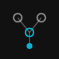

<p align="center">
  
</p>

<h1 align="center">@prsm/cells</h1>

A DAG of named cells. Each cell holds a value. When a cell changes, everything downstream recomputes automatically. Think spreadsheet - cell A1 is a price, B1 is a tax rate, C1 is `=A1 * (1 + B1)`. Now imagine A1 polls a stock API every 10 seconds and C1 calls an LLM to generate analysis. That's @prsm/cells.

Continuous reactive dataflow for the backend. Not a job runner, not a task queue - a living graph of derived state that stays current as its inputs change. Computations can be sync or async (API calls, LLM calls, database queries), and with Redis the same graph runs across multiple instances with exactly-once computation and automatic value sync.

## Installation

```bash
npm install @prsm/cells
```

Requires Node.js >= 20. Redis required only for distributed mode.

## Quick Start

```js
import { createGraph } from "@prsm/cells"

const g = createGraph()

const price = g.cell("price", 100)
const tax = g.cell("tax", 0.08)
const total = g.cell("total", () => price() * (1 + tax()))

total.on((value) => console.log("total:", value))

price(200) // total: 216
```

`g.cell()` returns an accessor function. Call it with no args to read, call it with an arg to write. Dependencies are tracked automatically - no dependency arrays needed.

## Async Cells

Any cell computation can be async. Dependencies are tracked across `await` boundaries via `AsyncLocalStorage`. Debounce prevents expensive work from firing on every upstream tick.

```js
const btc = g.cell("btc", 0)
btc.poll(() => fetchPrice("BTC"), "10s")

const analysis = g.cell("analysis", async () => {
  return await llm.complete(`BTC at $${btc()}. Brief market analysis.`)
}, { debounce: "30s" })

const alert = g.cell("alert", () => {
  return { price: btc(), analysis: analysis(), timestamp: Date.now() }
})
```

Price polls every 10 seconds. Analysis recomputes at most every 30 seconds. Alert updates whenever either upstream settles. You describe the relationships - the graph handles when things run.

## Distributed Mode

Add Redis and the graph works across multiple instances with no code changes.

```js
const g = createGraph({
  redis: { host: "127.0.0.1", port: 6379 }
})

const price = g.cell("price", 0)
const doubled = g.cell("doubled", () => price() * 2)

await g.ready()
```

`price(100)` on instance A propagates to instance B. Computed handlers run exactly once (lock winner computes, result is broadcast to all). Polling is coordinated so only one instance hits the external API per interval tick. Listeners fire on every instance, so each can push to its own connected clients.

## API

### `createGraph(options?)`

```js
const g = createGraph()                                       // local mode
const g = createGraph({ redis: { host: "...", port: 6379 } }) // distributed
```

Options:
- `redis` - Redis connection config. When provided, enables distributed mode
- `prefix` - Redis key prefix (default `"cell:"`)
- `lockTtl` - Lock duration for computation (default `"30s"`)

### `g.cell(name, value)` - source cell

```js
const config = g.cell("config", { theme: "dark" })
config()                  // { theme: "dark" }
config({ theme: "light" }) // updates value, triggers downstream
```

### `g.cell(name, fn, options?)` - computed cell

```js
const total = g.cell("total", () => price() * (1 + tax()))

const summary = g.cell("summary", async () => {
  return await generateSummary(data())
}, { debounce: "5s" })
```

Dependencies are discovered automatically by tracking which cell accessors are called during computation. Dependencies are re-tracked on every computation, so conditional deps work naturally.

Options:
- `debounce` - Duration string or ms. Delays recomputation after rapid dep changes
- `equals` - Custom equality function `(prev, next) => boolean`

### Cell accessor methods

```js
const off = total.on((value, state) => { ... })   // observe changes
off()                                               // unsubscribe

total.onError((error, state) => { ... })           // observe errors

total.state           // { value, status, error, updatedAt, computeTime }
total.name            // "total"

price.poll(fn, "10s") // fetch external data on a recurring interval
price.stop()          // stop polling

total.remove()        // remove (throws if other cells depend on it)
price.removeTree()    // remove cell + all downstream
```

### Graph-level methods

```js
g.set("price", 200)          // update source cell by name (escape hatch)
g.get("total")               // full state by name
g.value("total")             // value by name

g.on((name, value, state) => { ... })  // wildcard listener
g.snapshot()                  // { price: 200, tax: 0.08, total: 216 }
g.cells()                    // graph topology + statuses

await g.ready()               // required for distributed mode
await g.destroy()             // tear down
```

## Polling

`poll` is how external data enters the graph on a schedule. The fn runs on the given interval, and the result is set as the cell's value. If the fn throws, the cell enters error state and downstream cells go stale, but polling continues - the next successful poll clears the error.

In distributed mode, polling is lock-coordinated so only one instance runs the fn per interval tick. The result propagates to all instances via Redis pub/sub.

## Example: live dashboard

A monitoring dashboard that polls services, derives health scores, and pushes state to connected clients.

```js
import { createGraph } from "@prsm/cells"

const g = createGraph({
  redis: { host: "127.0.0.1", port: 6379 }
})

// sources: poll external services
const dbLatency = g.cell("dbLatency", 0)
dbLatency.poll(async () => {
  const start = Date.now()
  await db.query("SELECT 1")
  return Date.now() - start
}, "5s")

const queueDepth = g.cell("queueDepth", 0)
queueDepth.poll(() => queue.pending(), "5s")

const errorRate = g.cell("errorRate", 0)
errorRate.poll(() => metrics.errorRate("5m"), "10s")

// derived: health score from all inputs
const health = g.cell("health", () => {
  const latency = dbLatency() > 200 ? 0 : 1
  const queue = queueDepth() > 1000 ? 0 : 1
  const errors = errorRate() > 0.05 ? 0 : 1
  return { score: latency + queue + errors, max: 3 }
})

// push full state to clients whenever anything changes
g.on(() => {
  server.writeRecord("dashboard:health", g.snapshot())
})

await g.ready()
```

Three instances can run this. Only one polls each service per tick. All three push to their own connected WebSocket clients.

## Behavior

### Propagation

Changes propagate in topological order. Async cells at the same level compute concurrently.

### Diamond Dependencies

If A depends on B and C, and both depend on D, changing D computes B and C first, then A once (not twice).

### Staleness

If a cell is computing (async) and a dependency changes, the in-flight result is discarded. The cell recomputes with fresh values.

### Error Handling

Errored cells retain their last good value. Downstream cells are marked stale but keep their values. Recovery is automatic when the error clears.

### Equality

Before propagating, values are compared (`===` for primitives, `JSON.stringify` for objects). No change = no downstream recomputation.

## License

MIT
